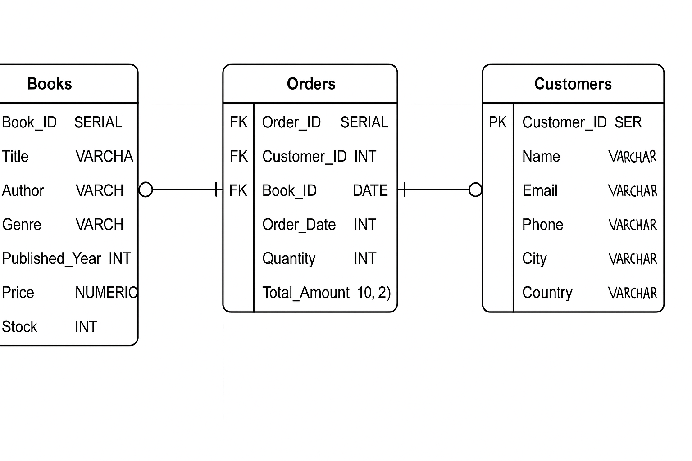
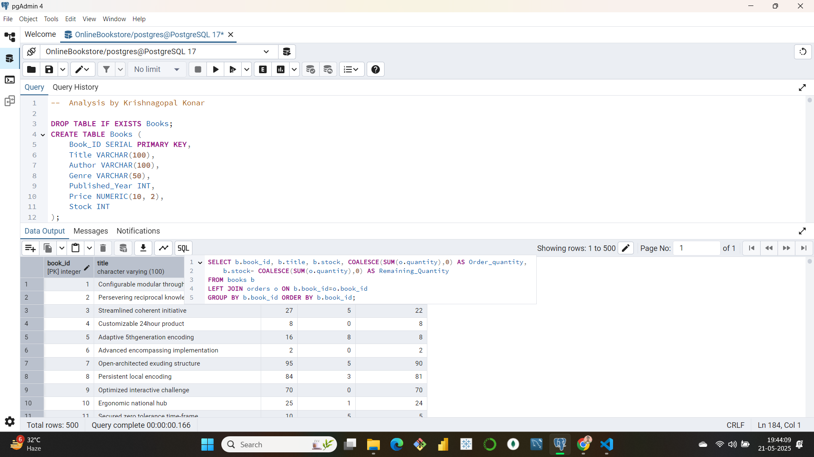

# 📚💻 Online Bookstore – SQL Database & Sales Analysis 📊🛒

A relational database project built using **PostgreSQL** to manage an online bookstore's inventory, customers, and orders.  
Includes advanced SQL queries for sales analysis, customer behavior insights, and inventory tracking.  
Perfect for learning backend logic in e-commerce platforms! 🧠🚀

---

## 🧩 Features

- 🗂️ Normalized schema: **Books**, **Customers**, and **Orders**
- 🔐 Uses primary & foreign key constraints for data integrity
- 📈 Real-world sales queries for business insight
- 🔍 Genre filtering, revenue calculations, stock analytics
- 📊 Visualizations: line chart, pie chart, stacked bar chart

---

## 🛠️ Technologies Used

| Tool        | Purpose                     |
|-------------|-----------------------------|
| PostgreSQL  | Database engine 🗃️          |
| SQL         | Query language 💬           |
| pgAdmin     | DB GUI 🖥️                   |              |

---

## 🧱 Database Schema Diagram



---

## 📥 Setup Instructions

### 🛠️ 1. Create the database:
```sql
CREATE DATABASE OnlineBookstore;
```

### 🔌 2. Connect to it:
```sql
\c OnlineBookstore
```

### 🧾 3. Create tables:
```sql
CREATE TABLE Books (
    Book_ID SERIAL PRIMARY KEY,
    Title VARCHAR(100),
    Author VARCHAR(100),
    Genre VARCHAR(50),
    Published_Year INT,
    Price NUMERIC(10, 2),
    Stock INT
);

CREATE TABLE Customers (
    Customer_ID SERIAL PRIMARY KEY,
    Name VARCHAR(100),
    Email VARCHAR(100),
    Phone VARCHAR(15),
    City VARCHAR(50),
    Country VARCHAR(150)
);

CREATE TABLE Orders (
    Order_ID SERIAL PRIMARY KEY,
    Customer_ID INT REFERENCES Customers(Customer_ID),
    Book_ID INT REFERENCES Books(Book_ID),
    Order_Date DATE,
    Quantity INT,
    Total_Amount NUMERIC(10, 2)
);
```

### 📦 4. Import Data:
```sql
COPY Books FROM '/path/Books.csv' CSV HEADER;
COPY Customers FROM '/path/Customers.csv' CSV HEADER;
COPY Orders FROM '/path/Orders.csv' CSV HEADER;
```

---


## 📊 Sales Analysis Visuals

**📌 Dashboard Preview:**



**📈 Line Chart:**


**🟰 Stacked Bar Chart:**


**🧁 Pie Chart:**


---

## 💡 Key Insights

- 📚 Total books sold by genre and author
- 💰 Top spending customers
- 🏙️ High-spending cities
- 📦 Remaining stock after all orders

---

## 🌐 Live GitHub Repository

🔗 [Visit Project on GitHub](https://github.com/konar01official/Online-Bookstore-SQL-Database-Sales-Analysis)

---

## 👨‍💻 Author

**Krishnagopal Konar**  
📧 [official.krishnakonar@gmail.com](mailto:official.krishnakonar@gmail.com)  
🔗 [GitHub](https://github.com/konar01official) | [LinkedIn](https://linkedin.com/in/krishnagopal-konar-b59684350)

---

